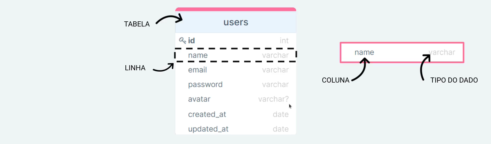
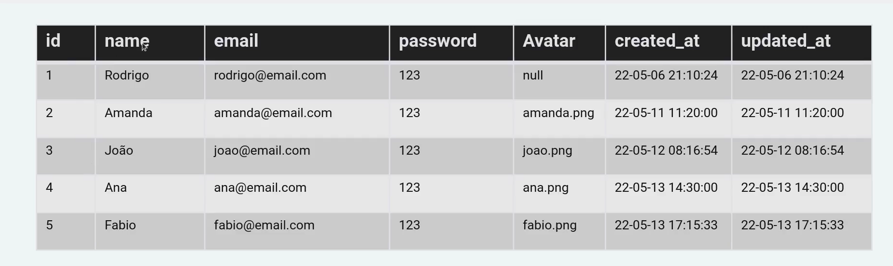
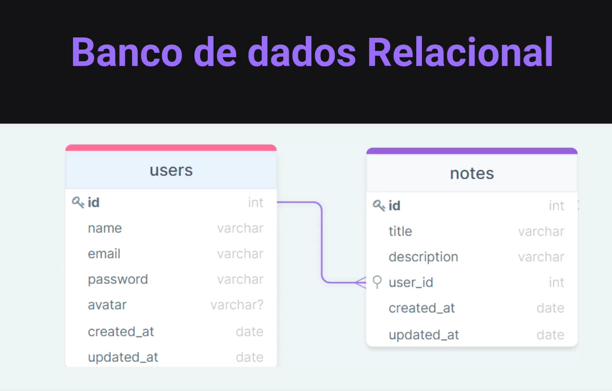
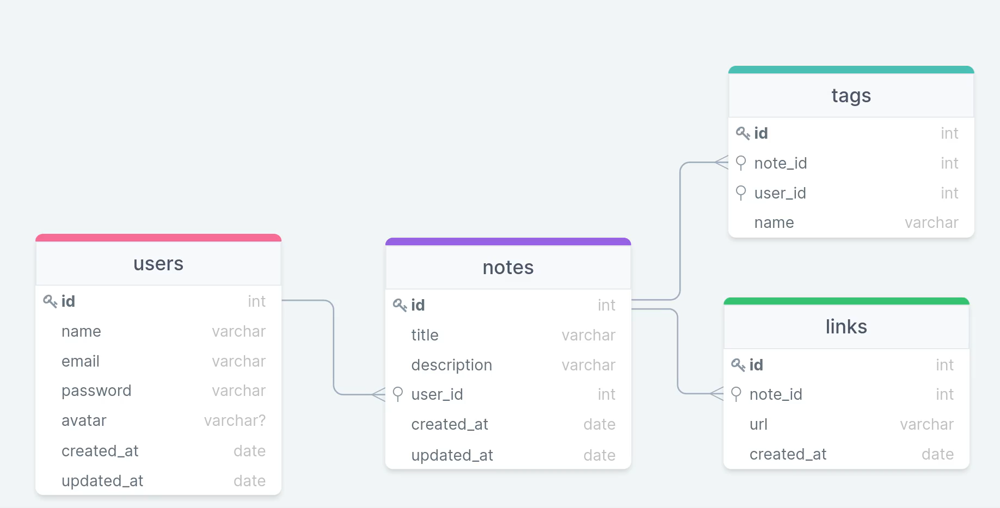

- framework Express - utilizado para lidar com requisições HTTP.

- node permite ir acrescentando os módulos que a gente precisa.

- métodos de requisição (GET, POST, PUT, DELETE, PATCH)
    - GET - leitura
    - POST - criação
    - PUT - Atualização
    - DELETE - Deleção
    - PATCH - Atualização parcial

- Route Params - utilizando recursos e parâmetros em nossa Rota
    ex. https://enderecoservidor.com.br/users/5
        user -> recurso
        5 -> parâmetro

- Query Params
    ex.https://enderecoservidor.com.br/users?page=2&limit=10
         depois ? é o query params
         add & para add um novo params

         ? -> separador
         page -> conteudo
        2 -> valor
        & -> separador
        limit ->  chave
        10 -> valor

A diferença entre eles é que no route params os valores são obrigatórios

- Recurso a biblioteca Nodemon. Com ele, não precisaremos ficar reiniciando o nosso servidor manualmente sempre que houver uma alteração.

- [Insomnia](https://insomnia.rest/)

- Body Params
    Quando usa o POST podemos enviar um cadastro através d corpo da requisição

- Controllers
    Camada - parte resposavel - por processar as requisições da aplicação, onde vamos ter as regras de negócio

- Servidor
    ponto de entrada da requisição

- HTTP Status Code
    Adiciona uma numeração na resposta que representa um estado

    1xx - informativo - a solicitação foi aceita ou o processamento continua em andamento
        ex. 102 processando

    2xx - sucesso
        ex. 200 requisição bem sucedida
        201 criado - geralmente utilizado para o POST após uma inserção

    3xx - redirecionamento
        ex. 301 movido permanentemente
        302 movido
    
    4xx - erro do cliente
        ex. 400 bad request
        401 not authorized
        404 not found

    5xx - erro no servidor - o servidor falhou ao concluir a solicitação
        ex. 500 erro interno

- `Middleware`é uma função que consegue interceptar a requisição
    - tem acesso ao objeto de solicitação (requisição), o objeto de resposta (resposta), e a próxima função de middleware no ciclo solicitação-resposta do aplicativo.
    - A próxima função de middleware é comumente denotada por uma variável chamada `next`
    - Podem:
        - Executar qualquer código
        - Fazer mudanças nos objetos de solicitação e resposta
        - Encerrar o ciclo de solicitação-resposta
        - Chamar o póximo middleware na pilha

- Banco de Dados
    são as suas propriedades/estruturas como: Tabela, linha, coluna, tipo de dado

    id - int (tipo de dado)
    name - varchar (txto)
    o ? significa que é opcional

    

    

 - Banco de dados `Relacional`

    

    o simbolo de chave é chamdo de `chave primaria` resgistra como unico dentro da tabela, não se repete

    cada usurio tem seu proprio id

    `foreign key` vem de outra tabela, ela é uma chave "visitante"

    `cardinalidade` - qual a frequencia que uma tabela se relaciona com outra

- Estrutura do Banco de Dados

    

    id  - garante um identificador unico